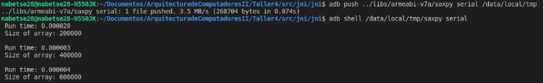
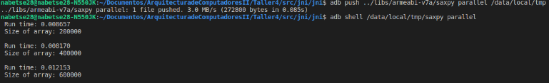
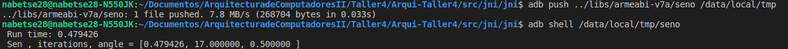
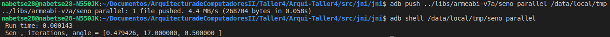

# Arqui-Taller4

## Information

This lab was about how to run programs in ARM Processor using an android device. In the same way as the [lab3](https://github.com/nabetse28/Arqui-Taller3) we use OMP, also this time we had to use [NEON](http://infocenter.arm.com/help/index.jsp?topic=/com.arm.doc.dui0205j/BABGHIFH.html) and [Android NDK](https://developer.android.com/ndk).

## Installation

1. Install [Android NDK](https://developer.android.com/ndk) this allows to run C code inside your device. It's recommended unzip the file and move it to the directory /opt/:

```bash
unzip android-ndk-r16b-linux-x86_64.zip
sudo mv android-ndk-r16b /opt/
```

2. Install Android Debug Bridge (ABD), the will allow to take the compiled application to the device.

```bash
sudo apt-get install android-tools-adb android-tools-fastboot
```

3. After these steps clone this repositorie. The only thing you have to do for test the files is change the following files.

**Inside Android.mk:**

```Makefile
LOCAL_MODULE := name_of_test_file
LOCAL_SRC_FILES := name_of_test_file.c
```

**Inside Application.mk:**

```Makefile
APP_MODULES := name_of_test_file cpufeatures
```

4. Inside _jni_ directory, excecute the following command to compile the ndk:

```bash
/opt/android-ndk-r16b/ndk-build
```

This command has to generate the directories _libs_ and _obj_ outside the _jni_ directory.

5. For send the _name_of_test_file.c_ to the device you have to excecute the following command inside the _jni_ directory:

```bash
abd push ../libs/armeabi-v7a/name_of_test_file /data/local/tmp
```

6. Excecute the _name_of_test_file_ inside the device, you have to excecute the command:

```bash
adb shell /data/local/tmp/name_of_test_file
```

## Testing

### saxpy_serial



### saxpy_parallel



### seno

#### seno with out parallel



#### seno with parallel


